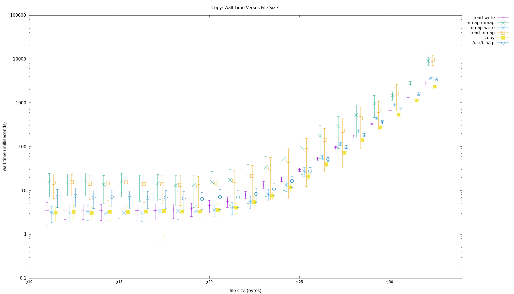

Copy files real fast.

- `read-write` calls `read()` and `write()` repeatedly with a configurable `--buffer` size.
- `mmap-mmap` maps both files into memory and copies between them.
- `mmap-write` maps the input file into memory and writes it to the output file.
- `read-mmap` maps the output file into memory and reads into it from the input file.
- `copy` uses `sendfile()` on Linux and `copyfile()` on Darwin.
- Compare with `cp`, which is safer and more versatile, but this is just about exploring.

`make -j` to build the programs. The build is in-tree. `make clean` undoes `make`.

`bin/` contains scripts that are handy for benchmarking the programs.

`etc/` contains visualization details, like SQL queries and gnuplot scripts.

`var/` is a placeholder for runtime data generated by `bin/` scripts.

`plot/` contains a makefile that uses files in `etc/` and `var/` to produce visualizations.

Here's the result of a run on my new Linux laptop. The error bars are one
standard deviation above and below the mean. Note that both axes are
logarithmic:

